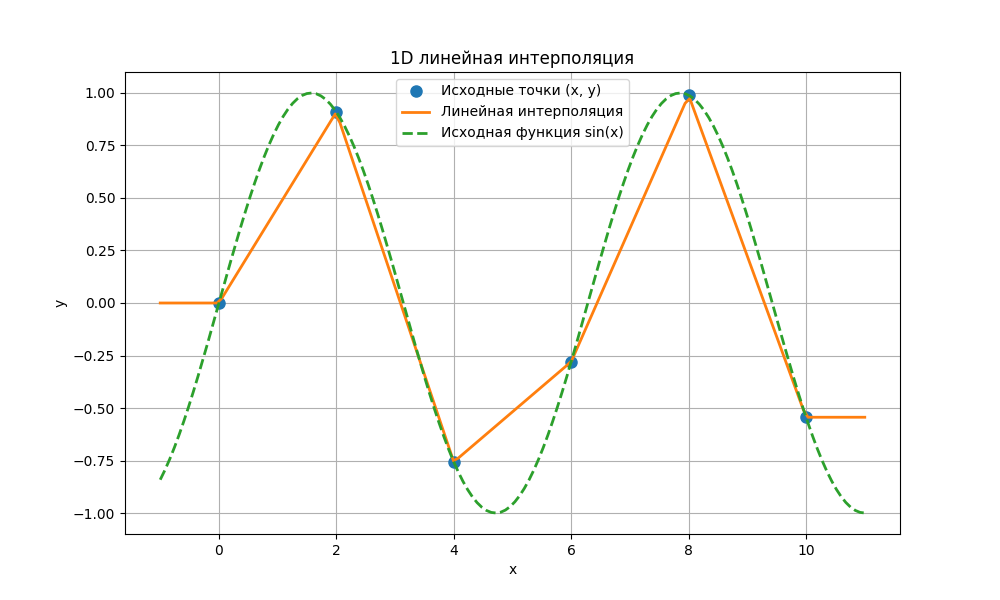
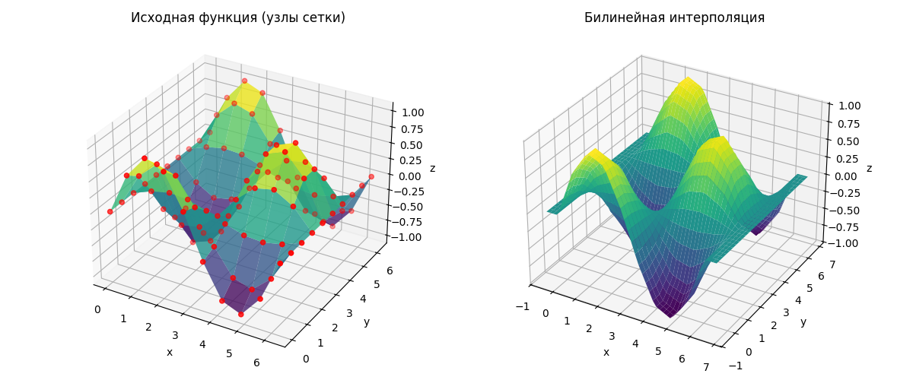
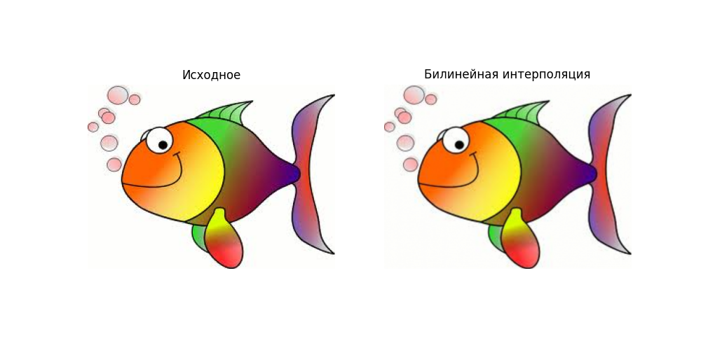

# Алгоритмы интерполяции ИППИ

## Оглавление

- [Описание проекта](#описание-проекта)
- [Структура проекта](#структура-проекта)
- [Установка](#установка)
- [Интерфейс командной строки (CLI)](#интерфейс-командной-строки-cli)
  - [Описание команды `interpolate`](#описание-команды-interpolate)
  - [Примеры использования CLI](#примеры-использования-cli)
- [Реализованные методы интерполяции](#реализованные-методы-интерполяции)
  - [1D: Линейная интерполяция](#1d-линейная-интерполяция)
  - [2D: Билинейная интерполяция](#2d-билинейная-интерполяция)
  - [Теория L2 (Проекция Галеркина)](#теория-l2-проекция-галеркина)
  - [2D: Оптимальная по L2 (Константные базисные)](#2d-оптимальная-по-l2-константные-базисные)
  - [2D: Оптимальная по L2 (Линейные базисные)](#2d-оптимальная-по-l2-линейные-базисные)
  - [2D: Оптимальная по L2 (Смешанные базисные)](#2d-оптимальная-по-l2-смешанные-базисные)
- [Тестирование](#тестирование)
- [Качество кода](#качество-кода)
- [Автоматизация задач с Nox](#автоматизация-задач-с-nox)

## Описание проекта

Проект реализует различные алгоритмы одномерной и двумерной интерполяции данных, с  применением к изменению размера изображений. Проект использует интерфейс командной строки (CLI) , управление зависимостями через Poetry, обеспечение качества кода с помощью Ruff и автоматическое тестирование с Pytest и Nox.


## Структура проекта

```
Interpolation_IITP/
├── src/                     
│   └── interpolation_lib/         
│       ├── __init__.py       
│       ├── interpolation_1d.py 
│       ├── interpolation_2d.py 
│       ├── image_processing.py 
│       └── cli.py            
│
├── tests/                    
│   ├── __init__.py
│   ├── test_cli.py          
│   ├── test_interpolation_1d.py  
│   └── test_interpolation_2d.py  
│
├── examples/                 
│   ├── run_1d_interpolation_example.py
│   ├──  run_2d_interpolation_example.py
│   ├──  run_image_interpolation_example.py
│   └── test.png           
│
├── pyproject.toml            
├── poetry.lock               
├── noxfile.py                
├── LICENSE 
├── README.md
└── .gitignore  

```
## Установка
Используйте  [Poetry](https://python-poetry.org/) для установки и управления зависимостями.

1.  **Клонируйте репозиторий:**
    ```bash
    git clone https://github.com/IsaenkovDanil/Interpolation_IITP.git
    cd Interpolation_IITP
    ```
2.  **Установите зависимости:**
    *   Для использования библиотеки и CLI:
        ```bash
        poetry install --no-dev
        ```
    *   Для разработки ( Ruff, Pytest, Nox):
        ```bash
        poetry install --with dev
        ```


## Интерфейс командной строки (CLI)

### Описание команды `interpolate`

Команда `interpolate` позволяет изменять размер изображений из командной строки.

```
Usage: interpolate [OPTIONS] INPUT_PATH X_SCALE Y_SCALE

  Изменяет размер изображения с помощью выбранного метода
  интерполяции.

Arguments:
  INPUT_PATH  [required] Путь к исходному файлу изображения.
  X_SCALE     [required] Коэффициент масштабирования по высоте (> 0).
  Y_SCALE     [required] Коэффициент масштабирования по ширине (> 0).

Options:
  -m, --method [bilinear|l2_const|l2_linear|l2_mixed]
                                  Алгоритм интерполяции.  [default: bilinear]
  -o, --output FILE               Путь для сохранения результата. Если не
                                  указан, результат не сохраняется.
  --show                          Показать исходное и результат после
                                  интерполяции.
  --help                          Показать это сообщение и выйти.
```

### Примеры использования CLI


*   Показать помощь:
    ```bash
    poetry run interpolate --help
    ```
* Увеличить image.png в 2 раза билинейно, сохранить в output.png, показать 
```bash
poetry run interpolate path/to/your/image.png 2.0 2.0 -m bilinear -o path/to/output.png --show
```

## Реализованные методы интерполяции

### 1D: Линейная интерполяция

*   **Теория:** Соединяет соседние известные точки $(x_k, y_k)$ и $(x_{k+1}, y_{k+1})$ прямыми линиями. Для точки $x$ между $x_k$ и $x_{k+1}$ значение $y$  на этой прямой:

    $$y(x) = y_k + (x - x_k) \frac{y_{k+1} - y_k}{x_{k+1} - x_k}$$

*   **Обозначения:**
    *   $(x_k, y_k), (x_{k+1}, y_{k+1})$: Координаты соседних известных точек.
    *   $x$: Координата точки, в которой ищется значение.
    *   $y(x)$: Интерполированное значение в точке $x$.

*   **Реализация:** `src/interpolation_lib/interpolation_1d.py` -> `linear_interpolation_1d()`
* **Описание:** применяет `linear_interpolation_1d` на функции `sin(x)` и строит график.
*   **Пример запуска :**
    ```bash
    poetry run python examples/run_1d_interpolation_example.py
    ```
    
 
    


### 2D: Билинейная интерполяция

*   **Теория:** Используется для данных на прямоугольной сетке. Значение $z$ в точке $(x, y)$ внутри ячейки с углами $(x_1, y_1), (x_2, y_1), (x_1, y_2), (x_2, y_2)$ и значениями $z_{11}, z_{21}, z_{12}, z_{22}$ вычисляется как:

    $$z(x, y) \approx (1-s)(1-t)z_{11} + s(1-t)z_{21} + (1-s)tz_{12} + stz_{22}$$

    где 
    *   $s = (x - x_1) / (x_2 - x_1)$: Нормированная координата по X внутри ячейки ($0 \le s \le 1$).
    *   $t = (y - y_1) / (y_2 - y_1)$: Нормированная координата по Y внутри ячейки ($0 \le t \le 1$).
    *   $z_{ij}$: Значение функции в углу $(x_i, y_j)$.
    
*   **Реализация:** `src/interpolation_lib/interpolation_2d.py` -> `bilinear_interpolation()`

*   **Пример запуска ( для функции):**
    ```bash
    poetry run python examples/run_2d_interpolation_example.py
    ```
    
*    **Описание:** применяет `bilinear_interpolation` на функции `sin(x)*cos(y)` и строит 3D-график.
    

   
*   **Пример запуска ( для изображения):**
    
    ```bash
    poetry run python examples/run_image_interpolation_example.py
    ```

    
    
    
*   **Пример запуска (CLI):**
*   **Описание:** Загружает тестовое изображение (`test_image.jpg` ), применяет билинейную интерполяцию с помощью `apply_interpolation_to_image` и показывает/сохраняет результат.
    ```bash
    
    poetry run interpolate test_image.jpg 2.0 2.0 --method bilinear --output output_bilinear.jpg --show
    ```


Следующие методы основаны на проекции Галеркина для консервативной интерполяции между сетками(L2 Оптимальные).

### Теория L2 (Проекция Галеркина)

Пусть $\psi^{old}$ - поле на старой сетке, $\psi^{new}$ - поле на новой сетке. 
Ищем $\psi^{new}$, минимизируя $\| \psi^{new} - \psi^{old} \|_{L2}$, это эквивалентно условию ортогональности ошибки к пространству базисных функций новой сетки:

$$\int (\psi^{new} - \psi^{old}) N_i^{new} dV = 0 \quad \forall i$$

где $N_i^{new}$ - базисные функции новой сетки и $\psi^{new} = \sum_j \psi_j^{new} N_j^{new}$ и $\psi^{old} = \sum_k \psi_k^{old} N_k^{old}$, получаем систему линейных алгебраических уравнений (СЛАУ):

$$\mathbf{M}^{new} \mathbf{\psi}^{new} = \mathbf{M}^{mixed} \mathbf{\psi}^{old}$$

*   $\mathbf{M}^{new}_{ij} = \int N_i^{new} N_j^{new} dV$ 
*   $\mathbf{M}^{mixed}_{ik} = \int N_i^{new} N_k^{old} dV$ 
*   $\mathbf{\psi}^{new}, \mathbf{\psi}^{old}$ (Векторы коэффициентов).
Решая систему, получаем коэффициенты $\mathbf{\psi}^{new}$ для интерполированного поля


### 2D: Оптимальная по L2 (Константные базисные)

*   **Теория:** Частный случай проекции Галеркина. Метод Гранди. Значение в новой ячейке $j$ ($Z_{new, j}$) — средневзвешенное значение старых ячеек $i$ ($Z_{old, i}$), пересекающихся с ней. Вес — площадь пересечения $A_{ij}$.
    
$$
Z_{\mathrm{new}, j} = \frac{\sum_{i} Z_{\mathrm{old}, i} \cdot A_{ij}}{\sum_{i} A_{ij}} = \frac{\sum_{i} Z_{\mathrm{old}, i} \cdot \operatorname{Area}(\mathrm{Cell}_{\mathrm{new}, j} \cap \mathrm{Cell}_{\mathrm{old}, i})}{\operatorname{Area}(\mathrm{Cell}_{\mathrm{new}, j})}
$$
    
*   **Реализация:** `src/interpolation_lib/interpolation_2d.py` -> `l2_constant_interpolation()` (*Сейчас заглушка*)


### 2D: Оптимальная по L2 (Линейные базисные)

*   **Теория:**  Используются кусочно-линейные базисные функции $N$. 
* Нужно решать систему $\mathbf{M}^{new} \mathbf{\psi}^{new} = \mathbf{M}^{mixed} \mathbf{\psi}^{old}$.
    *    $\mathbf{M}^{new}_{ij} = \int N_i^{new} N_j^{new} dV$
    *   $\mathbf{M}^{mixed}_{ik} = \int N_i^{new} N_k^{old} dV$
    *   $\mathbf{\psi}$ - векторы коэффициентов при базисных функциях.

*   **Реализация:** `src/interpolation_lib/interpolation_2d.py` -> `l2_linear_interpolation()` (*Сейчас заглушка*)


### 2D: Оптимальная по L2 (Смешанные базисные)

*   **Теория:** Аналогично предыдущему пункту, но в  $\mathbf{M}^{mixed}_{ik} = \int N_i^{new} N_k^{old} dV$ одна из базисных функций постоянная, а другая - линейная.
*   **Реализация:** `src/interpolation_lib/interpolation_2d.py` -> `l2_mixed_interpolation()` (*Сейчас заглушка*)


## Тестирование

Проект использует `pytest` для тестирования и `pytest-cov` для измерения покрытия кода.

*   **Запуск всех тестов:**
    ```bash
    poetry run pytest -v
    ```
*   **Запуск тестов с отчетом о покрытии:**
    ```bash
    poetry run pytest --cov=src/interpolation_lib 
    ```
    
    HTML-отчет о покрытии будет в папке `htmlcov/`.

## Качество кода

Проект использует `ruff` для форматирования . 
Настройки находятся в `pyproject.toml`.

*   **Проверка форматирования:**
    ```bash
    poetry run ruff format --check .
    ```
*   **Применить форматирование:**
    ```bash
    poetry run ruff format .
    ```
*   **Проверка на ошибки:**
    ```bash
    poetry run ruff check .
    ```
*   **Проверить и исправить:**
    ```bash
    poetry run ruff check --fix .
    ```
## Автоматизация задач с Nox

Проект использует `Nox` для форматирования кода, проверки стиля (линтинг) и запуск тестов. 

Для работы с   Poetry используем плагин `nox-poetry`. Nox берёт зависимости  из `poetry.lock` или экспортирует их в `requirements.txt`.

**Описание сессий в файле `noxfile.py`:**

*   `formatter`: Запускает `ruff format` 
*   `linter`: Запускает `ruff check` 
*   `mypy`: Запускает `mypy` 
*   `pytype`: Запускает `pytype`
*   `tests`: Запускает тестирование

**Запуск сессий Nox:**

*   Запустить сессии по умолчанию:
    ```bash
    nox
    ```
*   Запустить конкретную сессию:
    ```bash
    nox -s format
    nox -s linter
    nox -s mypy
    nox -s pytype
    nox -s tests
    ```
*   Запустить тесты для конкретной версии Python:
    ```bash
    nox -s tests --python 3.12
    ```
